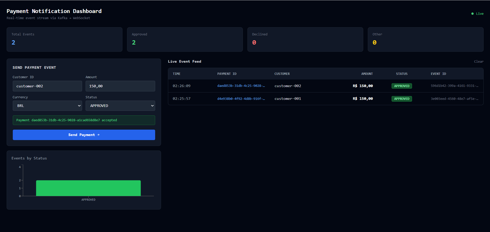
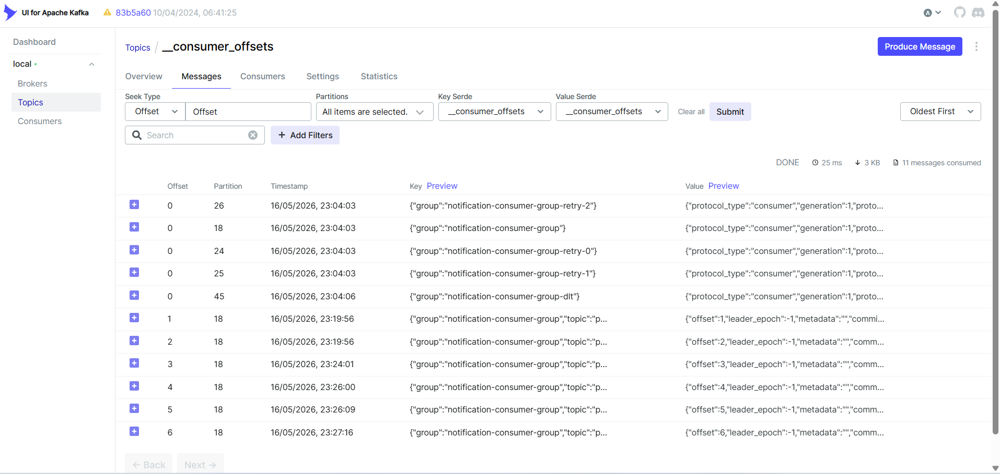

# Realtime Payment Notification System

A **production-grade**, event-driven payment notification system built with Java 21, Spring Boot, Apache Kafka, WebSocket, React, and Docker — demonstrating senior-level distributed systems engineering with zero infrastructure cost.

---

## Architecture

```
┌─────────────┐   POST /payments   ┌──────────────────┐
│   React      │ ─────────────────► │  payment-producer │
│  Dashboard  │                    │  (Spring Boot)    │
│             │                    │  port 8081        │
│  SockJS +   │                    └────────┬──────────┘
│  STOMP      │                             │ publishes
│             │                             ▼
│  /topic/    │                    ┌──────────────────┐
│  payments   │                    │   Apache Kafka   │
│             │                    │  payment-events  │
│   port 3000 │                    │  + retry topics  │
└──────┬──────┘                    │  + DLQ (-dlt)    │
       │ WebSocket                 └────────┬──────────┘
       │                                    │ consumes
       ▼                                    ▼
┌─────────────────┐  HTTP POST   ┌──────────────────────┐
│ websocket-      │ ◄─────────── │ notification-consumer │
│ gateway         │  /internal/  │  (Spring Boot)        │
│ (Spring Boot)   │  notify      │  - Idempotency check  │
│  port 8083      │              │  - PostgreSQL persist  │
└─────────────────┘              │  - Retry + DLQ logic  │
                                 │  port 8082             │
                                 └──────────────────────┘
                                          │
                                          ▼
                                 ┌──────────────────┐
                                 │   PostgreSQL      │
                                 │   payments_db     │
                                 │   port 5432       │
                                 └──────────────────┘
```

---

## Screenshots

### React Dashboard — Live Event Feed

*Real-time payment events pushed via Kafka → WebSocket → STOMP. The dashboard shows live stats, a send-payment form, and an event table with correlation IDs.*

### Kafka UI — Consumer Offsets & Retry Topics

*Kafka UI showing the `__consumer_offsets` topic with active consumer groups — including the main `notification-consumer-group` plus its retry groups (`-retry-0`, `-retry-1`, `-retry-2`) and DLT (`-dlt`). Confirms all 4 retry levels are registered and tracking offsets.*

---

## Features

| Feature | Description |
|---|---|
| **Idempotency** | Events are deduplicated by `eventId` — Kafka redeliveries are safe |
| **Dead Letter Queue** | After 3 retries with exponential backoff, events route to `-dlt` topic |
| **Retry Topics** | `payment-events-retry-0/1/2` with 5s→15s→30s backoff |
| **WebSocket Push** | Real-time delivery to React clients via STOMP over SockJS |
| **Correlation ID** | Every event carries `X-Correlation-ID` for distributed tracing |
| **Structured Logging** | JSON-compatible logs with MDC correlation context |
| **Testcontainers** | Integration tests with real Kafka + PostgreSQL — no mocks |
| **Docker Compose** | Single command to run entire stack locally |

---

## Quick Start

```bash
git clone https://github.com/your-username/realtime-payment-notification-system.git
cd realtime-payment-notification-system

docker compose up --build
```

Services available at:

| Service | URL |
|---|---|
| React Dashboard | http://localhost:3000 |
| Kafka UI | http://localhost:8080 |
| Payment Producer API | http://localhost:8081 |
| Payment Producer Swagger | http://localhost:8081/swagger-ui.html |
| Notification Consumer | http://localhost:8082 |
| Notification Consumer Swagger | http://localhost:8082/swagger-ui.html |
| WebSocket Gateway | http://localhost:8083 |
| PostgreSQL | localhost:5432 |

---

## REST API Reference

### POST a Payment
```bash
curl -X POST http://localhost:8081/api/v1/payments \
  -H "Content-Type: application/json" \
  -H "X-Correlation-ID: my-trace-id-001" \
  -d '{
    "customerId": "customer-001",
    "amount": 250.00,
    "currency": "BRL",
    "status": "APPROVED"
  }'
```

Response:
```json
{
  "paymentId": "a3f8b2c1-...",
  "correlationId": "my-trace-id-001",
  "status": "APPROVED",
  "message": "Payment event published to Kafka"
}
```

### Query Payments (paginated)
```bash
curl "http://localhost:8081/api/v1/payments?page=0&size=20"
curl "http://localhost:8081/api/v1/payments/{paymentId}"
```

### Query Notifications (paginated)
```bash
curl "http://localhost:8082/api/v1/notifications?page=0&size=20"
curl "http://localhost:8082/api/v1/notifications/customer/{customerId}"
curl "http://localhost:8082/api/v1/notifications/status/APPROVED"
curl "http://localhost:8082/api/v1/notifications/{eventId}"
```

> Full interactive API documentation available at the Swagger UI links above.

The event flows:
1. API persists payment → publishes to `payment-events`
2. Consumer reads, checks idempotency, persists notification
3. Consumer calls WebSocket Gateway
4. Gateway broadcasts to all connected React clients via STOMP

---

## Idempotency Design

```
Kafka delivers event (at-least-once guarantee)
          │
          ▼
  existsByEventId(eventId)?
          │
    YES ──┘── NO
     │         │
  SKIP    persist + broadcast
  (log warn)
```

The `eventId` is indexed with a `UNIQUE` constraint on the database.  
Even under race conditions, a `DataIntegrityViolationException` is caught and swallowed gracefully.

**Why this matters:** Kafka guarantees _at-least-once_ delivery. Without idempotency, a broker rebalance or consumer crash would process the same payment twice — charging customers double.

---

## DLQ & Retry Strategy

```
payment-events
    │
    ├── failure → payment-events-retry-0  (5s delay)
    │                   │
    │             failure → payment-events-retry-1  (15s delay)
    │                             │
    │                       failure → payment-events-retry-2  (30s delay)
    │                                         │
    │                                   failure → payment-events-dlt
    │                                              (Dead Letter Topic)
    ▼
 success → persist + notify
```

DLT events are logged at ERROR level and can be routed to alerting (PagerDuty, Slack) without code changes.

**Architectural decision:** We use `@RetryableTopic` (Spring Kafka non-blocking retries) instead of blocking `RetryTemplate`. This prevents the consumer thread from stalling and allows other partitions to continue processing during retry delays.

---

## Kafka vs RabbitMQ — Architectural Decision

| Dimension | Kafka | RabbitMQ |
|---|---|---|
| **Ordering** | Per-partition guarantee | Queue-level, weaker |
| **Replay** | Yes — consumer can re-read from offset | No |
| **Throughput** | Millions/sec (log-structured) | Moderate |
| **Retention** | Configurable (days/weeks) | Until consumed |
| **DLQ** | Native retry topics | Dead letter exchange |
| **Use case fit** | Event sourcing, audit trail | Task queues, RPC |

Kafka was chosen because payment events require **audit replay**, **ordering per payment**, and **high throughput** during peak hours.

---

## Exactly-Once vs At-Least-Once

This system uses **at-least-once delivery** (Kafka default) + **application-level idempotency**:

- Producer: `enable.idempotence=true`, `acks=all` — prevents broker-level duplicates
- Consumer: `eventId` deduplication — prevents application-level duplicates

True Kafka exactly-once (`isolation.level=read_committed` + transactions) adds operational complexity and was deferred as a V2 enhancement.

---

## Running Tests

```bash
# payment-producer integration tests (uses Testcontainers)
cd backend/payment-producer
mvn test

# notification-consumer idempotency tests
cd backend/notification-consumer
mvn test
```

Tests spin up real Kafka and PostgreSQL containers — no mocking of infrastructure.

---

## Tech Stack

| Layer | Technology |
|---|---|
| Language | Java 21 (Virtual Threads ready) |
| Framework | Spring Boot 3.3 |
| Messaging | Apache Kafka + Spring Kafka |
| Persistence | Spring Data JPA + PostgreSQL 16 |
| Real-time | Spring WebSocket + STOMP + SockJS |
| HTTP Client | Spring RestClient (RestTemplate-free) |
| API Docs | SpringDoc OpenAPI 3 / Swagger UI |
| Error Handling | RFC 7807 ProblemDetail |
| Observability | MDC Correlation ID + Spring Actuator + Kafka UI |
| Testing | JUnit 5 + Testcontainers + Awaitility |
| Frontend | React 18 + Vite + TailwindCSS + Recharts |
| Infra | Docker Compose + Nginx |

---

## Project Structure

```
realtime-payment-notification-system/
│
├── backend/
│   ├── shared-kernel/          # Shared DTOs and domain events
│   ├── payment-producer/       # REST API → Kafka producer
│   ├── notification-consumer/  # Kafka consumer with idempotency + DLQ
│   └── websocket-gateway/      # STOMP WebSocket broadcast server
│
├── frontend/
│   └── dashboard-react/        # Live event dashboard (React + Vite)
│
├── infra/
│   └── postgres/
│       └── init.sql
│
├── docker-compose.yml
└── README.md
```

---

## Roadmap

### V2
- [ ] Redis cache for hot idempotency checks (sub-millisecond)
- [ ] JWT authentication on WebSocket handshake
- [ ] Prometheus metrics + Grafana dashboard
- [ ] Distributed tracing with OpenTelemetry

### V3
- [ ] Kubernetes local cluster with Kind
- [ ] CI/CD pipeline with GitHub Actions
- [ ] Contract testing with Pact

### V4
- [ ] Outbox Pattern (transactional guarantee between DB and Kafka)
- [ ] Saga Pattern for multi-step payment workflows
- [ ] CQRS read model for analytics queries

---

## Author

Built by **Zez Technology** — demonstrating production-grade event-driven architecture using 100% free, open-source tooling.
